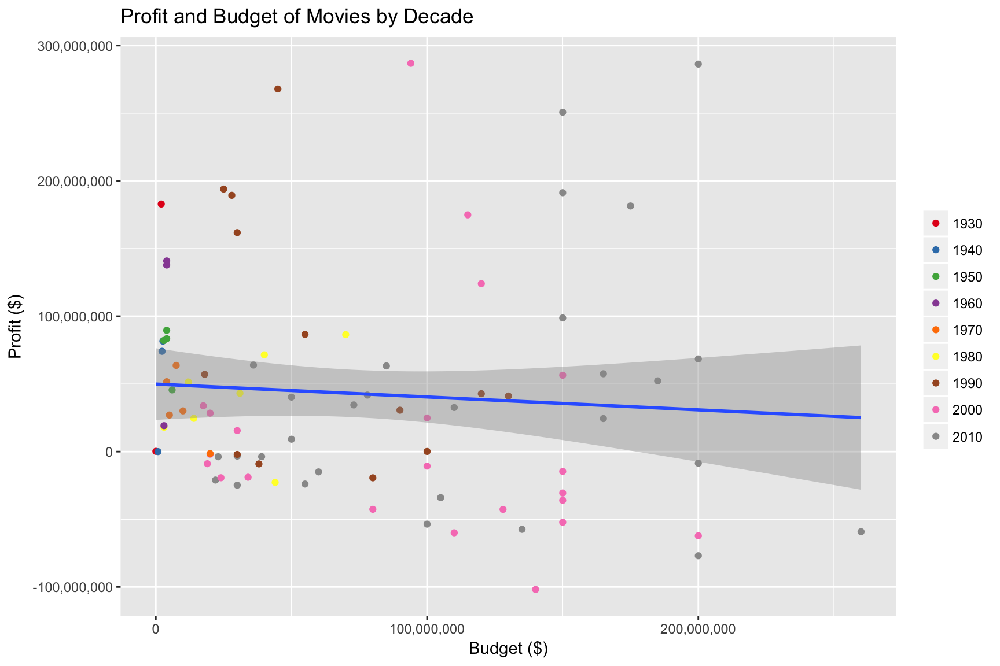

The date is December  6, 2017  

#Big Budget = Top Box Office? Not so for Disney Animations {#paragraph .n} 


```r
library(mdsr)
library(RMySQL)
library(dplyr)
library(ggplot2)
library(stringr)
library(ggthemes)
library(gridExtra)

db <- dbConnect_scidb(dbname = "imdb")
```

```r
disney <- db %>%
  dbGetQuery("SELECT DISTINCT (t.id),t.title, t.production_year, mi.info, mi3.info FROM company_name cn
              JOIN movie_companies mc ON mc.company_id = cn.id
              JOIN title t ON mc.movie_id = t.id
              JOIN movie_info mi on mi.movie_id = t.id
              JOIN movie_info mi2 on mi2.movie_id = t.id
              JOIN movie_info mi3 on mi3.movie_id = t.id
              WHERE cn.name LIKE '%Walt Disney%'
              AND t.kind_id = 1
              AND mi.info_type_id=105
             AND mi2.info_type_id = 3
            AND mi2.info = 'Animation'
            AND mi3.info_type_id=107
              AND mi3.info LIKE '%(USA)'")

colnames(disney)[4]= "budget"
colnames(disney)[5]= "gross"
save(disney,file = "Disney.rda")
```


```r
load("Disney.rda")

disney_clean <- disney %>% 
  filter(id != 3792055 & id != 3968288) %>%
  select(-id) %>%
  arrange(production_year) %>% 
  mutate(gross = str_extract(strsplit(gross,' '),"[[0-9]+,]+")) %>% 
  mutate(gross = as.numeric(gsub(",","",gross))) %>% 
  mutate(budget= str_extract(strsplit(budget,' '),"[[0-9]+,]+")) %>% 
  mutate(budget = as.numeric(gsub(",","",budget)))

disney_clean <- disney_clean %>%
  mutate(decade = (production_year %/% 10)*10, profit = gross-budget) 
```

From *Three Little Pigs* in 1933 to *Coco* in November 2017, Disney animated films are an all-time favorite, attracting curious kids and nostalgic adults alike. The cost of making animated films have soared dramatically, with a competitive market, sophisticated technologies, and ever-expanding crew. Behind the glamorous visual effects and splendid plots, however, the profit might no longer justify the cost. 


To investigate this relationship between profit and cost, we pulled Disney animations data from the IMDB database, from Three Little Pigs in 1933 that runs for eight minutes, to the smartphone-themed unsuccessful The Emoji Movie in 2017. The data confirm our gut feeling that an increase in both the cost and the box office is a definite trend over time, but the relationship between cost and profit is muddier.

```r
disney_clean
```

<div data-pagedtable="false">
  <script data-pagedtable-source type="application/json">
{"columns":[{"label":["title"],"name":[1],"type":["chr"],"align":["left"]},{"label":["production_year"],"name":[2],"type":["int"],"align":["right"]},{"label":["budget"],"name":[3],"type":["dbl"],"align":["right"]},{"label":["gross"],"name":[4],"type":["dbl"],"align":["right"]},{"label":["decade"],"name":[5],"type":["dbl"],"align":["right"]},{"label":["profit"],"name":[6],"type":["dbl"],"align":["right"]}],"data":[{"1":"Three Little Pigs","2":"1933","3":"15720","4":"250000","5":"1930","6":"234280"},{"1":"Snow White and the Seven Dwarfs","2":"1937","3":"2000000","4":"184925485","5":"1930","6":"182925485"},{"1":"Fantasia","2":"1940","3":"2280000","4":"76408097","5":"1940","6":"74128097"},{"1":"Pinocchio","2":"1940","3":"2600000","4":"84254167","5":"1940","6":"81654167"},{"1":"Victory Through Air Power","2":"1943","3":"788000","4":"799000","5":"1940","6":"11000"},{"1":"Cinderella","2":"1950","3":"2900000","4":"85000000","5":"1950","6":"82100000"},{"1":"Peter Pan","2":"1953","3":"4000000","4":"87404651","5":"1950","6":"83404651"},{"1":"Lady and the Tramp","2":"1955","3":"4000000","4":"93600000","5":"1950","6":"89600000"},{"1":"Sleeping Beauty","2":"1959","3":"6000000","4":"51600000","5":"1950","6":"45600000"},{"1":"One Hundred and One Dalmatians","2":"1961","3":"4000000","4":"144880014","5":"1960","6":"140880014"},{"1":"The Sword in the Stone","2":"1963","3":"3000000","4":"22182353","5":"1960","6":"19182353"},{"1":"The Jungle Book","2":"1967","3":"4000000","4":"141843612","5":"1960","6":"137843612"},{"1":"The AristoCats","2":"1970","3":"4000000","4":"55675257","5":"1970","6":"51675257"},{"1":"Bedknobs and Broomsticks","2":"1971","3":"20000000","4":"18530000","5":"1970","6":"-1470000"},{"1":"Robin Hood","2":"1973","3":"5000000","4":"32056467","5":"1970","6":"27056467"},{"1":"Pete's Dragon","2":"1977","3":"10000000","4":"40100000","5":"1970","6":"30100000"},{"1":"The Rescuers","2":"1977","3":"7500000","4":"71215869","5":"1970","6":"63715869"},{"1":"The Fox and the Hound","2":"1981","3":"12000000","4":"63456988","5":"1980","6":"51456988"},{"1":"Mickey's Christmas Carol","2":"1983","3":"3000000","4":"21000000","5":"1980","6":"18000000"},{"1":"The Black Cauldron","2":"1985","3":"44000000","4":"21288692","5":"1980","6":"-22711308"},{"1":"The Great Mouse Detective","2":"1986","3":"14000000","4":"38600000","5":"1980","6":"24600000"},{"1":"Oliver & Company","2":"1988","3":"31000000","4":"74151346","5":"1980","6":"43151346"},{"1":"Who Framed Roger Rabbit","2":"1988","3":"70000000","4":"156452370","5":"1980","6":"86452370"},{"1":"The Little Mermaid","2":"1989","3":"40000000","4":"111543479","5":"1980","6":"71543479"},{"1":"The Rescuers Down Under","2":"1990","3":"30000000","4":"27931461","5":"1990","6":"-2068539"},{"1":"Beauty and the Beast","2":"1991","3":"25000000","4":"218967620","5":"1990","6":"193967620"},{"1":"Aladdin","2":"1992","3":"28000000","4":"217350219","5":"1990","6":"189350219"},{"1":"The Nightmare Before Christmas","2":"1993","3":"18000000","4":"75082668","5":"1990","6":"57082668"},{"1":"The Lion King","2":"1994","3":"45000000","4":"312900000","5":"1990","6":"267900000"},{"1":"Pocahontas","2":"1995","3":"55000000","4":"141600000","5":"1990","6":"86600000"},{"1":"Toy Story","2":"1995","3":"30000000","4":"191796233","5":"1990","6":"161796233"},{"1":"The Hunchback of Notre Dame","2":"1996","3":"100000000","4":"100138851","5":"1990","6":"138851"},{"1":"James and the Giant Peach","2":"1996","3":"38000000","4":"28934758","5":"1990","6":"-9065242"},{"1":"A Bug's Life","2":"1998","3":"120000000","4":"162798565","5":"1990","6":"42798565"},{"1":"Mulan","2":"1998","3":"90000000","4":"120620254","5":"1990","6":"30620254"},{"1":"Tarzan","2":"1999","3":"130000000","4":"171091819","5":"1990","6":"41091819"},{"1":"Fantasia 2000","2":"1999","3":"80000000","4":"60655420","5":"1990","6":"-19344580"},{"1":"The Emperor's New Groove","2":"2000","3":"100000000","4":"89302687","5":"2000","6":"-10697313"},{"1":"The Tigger Movie","2":"2000","3":"30000000","4":"45554533","5":"2000","6":"15554533"},{"1":"Monsters, Inc.","2":"2001","3":"115000000","4":"289916256","5":"2000","6":"174916256"},{"1":"Sen to Chihiro no kamikakushi","2":"2001","3":"19000000","4":"10055859","5":"2000","6":"-8944141"},{"1":"Treasure Planet","2":"2002","3":"140000000","4":"38176783","5":"2000","6":"-101823217"},{"1":"Return to Never Land","2":"2002","3":"20000000","4":"48430258","5":"2000","6":"28430258"},{"1":"Finding Nemo","2":"2003","3":"94000000","4":"380843261","5":"2000","6":"286843261"},{"1":"Brother Bear","2":"2003","3":"128000000","4":"85336277","5":"2000","6":"-42663723"},{"1":"Home on the Range","2":"2004","3":"110000000","4":"50030461","5":"2000","6":"-59969539"},{"1":"Hauru no ugoku shiro","2":"2004","3":"24000000","4":"4711096","5":"2000","6":"-19288904"},{"1":"Chicken Little","2":"2005","3":"150000000","4":"135386665","5":"2000","6":"-14613335"},{"1":"Pooh's Heffalump Movie","2":"2005","3":"20000000","4":"18098433","5":"2000","6":"-1901567"},{"1":"Hoodwinked!","2":"2005","3":"17500000","4":"51386611","5":"2000","6":"33886611"},{"1":"Cars","2":"2006","3":"120000000","4":"244082982","5":"2000","6":"124082982"},{"1":"The Wild","2":"2006","3":"80000000","4":"37384046","5":"2000","6":"-42615954"},{"1":"Ratatouille","2":"2007","3":"150000000","4":"206445654","5":"2000","6":"56445654"},{"1":"Meet the Robinsons","2":"2007","3":"150000000","4":"97822171","5":"2000","6":"-52177829"},{"1":"Bolt","2":"2008","3":"150000000","4":"114053579","5":"2000","6":"-35946421"},{"1":"Gake no ue no Ponyo","2":"2008","3":"34000000","4":"15090400","5":"2000","6":"-18909600"},{"1":"G-Force","2":"2009","3":"150000000","4":"119436770","5":"2000","6":"-30563230"},{"1":"Cloudy with a Chance of Meatballs","2":"2009","3":"100000000","4":"124870275","5":"2000","6":"24870275"},{"1":"A Christmas Carol","2":"2009","3":"200000000","4":"137855863","5":"2000","6":"-62144137"},{"1":"Tangled","2":"2010","3":"260000000","4":"200821936","5":"2010","6":"-59178064"},{"1":"Kari-gurashi no Arietti","2":"2010","3":"23000000","4":"19202743","5":"2010","6":"-3797257"},{"1":"Gnomeo & Juliet","2":"2011","3":"36000000","4":"99967670","5":"2010","6":"63967670"},{"1":"The Smurfs","2":"2011","3":"110000000","4":"142614158","5":"2010","6":"32614158"},{"1":"The Adventures of Tintin","2":"2011","3":"135000000","4":"77591831","5":"2010","6":"-57408169"},{"1":"Cars 2","2":"2011","3":"200000000","4":"191452396","5":"2010","6":"-8547604"},{"1":"Arthur Christmas","2":"2011","3":"100000000","4":"46462469","5":"2010","6":"-53537531"},{"1":"Winnie the Pooh","2":"2011","3":"30000000","4":"26692846","5":"2010","6":"-3307154"},{"1":"Kokuriko-zaka kara","2":"2011","3":"22000000","4":"1002895","5":"2010","6":"-20997105"},{"1":"Hotel Transylvania","2":"2012","3":"85000000","4":"148313048","5":"2010","6":"63313048"},{"1":"Frankenweenie","2":"2012","3":"39000000","4":"35291068","5":"2010","6":"-3708932"},{"1":"Brave","2":"2012","3":"185000000","4":"237283207","5":"2010","6":"52283207"},{"1":"The Pirates! In an Adventure with Scientists!","2":"2012","3":"55000000","4":"31051126","5":"2010","6":"-23948874"},{"1":"Wreck-It Ralph","2":"2012","3":"165000000","4":"189422889","5":"2010","6":"24422889"},{"1":"Monsters University","2":"2013","3":"200000000","4":"268492764","5":"2010","6":"68492764"},{"1":"Planes","2":"2013","3":"50000000","4":"90288712","5":"2010","6":"40288712"},{"1":"Cloudy with a Chance of Meatballs 2","2":"2013","3":"78000000","4":"119793567","5":"2010","6":"41793567"},{"1":"Kaze tachinu","2":"2013","3":"30000000","4":"5209580","5":"2010","6":"-24790420"},{"1":"The Smurfs 2","2":"2013","3":"105000000","4":"71017784","5":"2010","6":"-33982216"},{"1":"Frozen","2":"2013","3":"150000000","4":"400738009","5":"2010","6":"250738009"},{"1":"Big Hero 6","2":"2014","3":"165000000","4":"222527828","5":"2010","6":"57527828"},{"1":"Planes: Fire & Rescue","2":"2014","3":"50000000","4":"59165787","5":"2010","6":"9165787"},{"1":"The Good Dinosaur","2":"2015","3":"200000000","4":"123087120","5":"2010","6":"-76912880"},{"1":"Inside Out","2":"2015","3":"175000000","4":"356461711","5":"2010","6":"181461711"},{"1":"Angry Birds","2":"2016","3":"73000000","4":"107509366","5":"2010","6":"34509366"},{"1":"Finding Dory","2":"2016","3":"200000000","4":"486295561","5":"2010","6":"286295561"},{"1":"Zootopia","2":"2016","3":"150000000","4":"341268248","5":"2010","6":"191268248"},{"1":"Moana","2":"2016","3":"150000000","4":"248757044","5":"2010","6":"98757044"},{"1":"Smurfs: The Lost Village","2":"2017","3":"60000000","4":"45020282","5":"2010","6":"-14979718"}],"options":{"columns":{"min":{},"max":[10]},"rows":{"min":[10],"max":[10]},"pages":{}}}
  </script>
</div>

To investigate the relationship between profit and cost, we pulled data on Disney animated films from the IMDB database, starting with *Three Little Pigs* in 1933, which runs for eight minutes, to the unsuccessful smartphone-themed *The Emoji Movie* in 2017, the latest record. The data confirms our gut feeling that an increase in the cost is a definite trend over time, but the relationship between cost and profit is muddy. 


```r
p<-ggplot(disney_clean,aes(x =budget, y = profit)) +
  geom_point(aes(color = factor(decade)),position='dodge')+
  scale_color_discrete(labels = c('1930', '1940', '1950', '1960', '1970', '1980', '1990', '2000', '2010'))+
  geom_smooth(method = 'lm') +
  scale_x_continuous(labels = scales::comma) +
  scale_y_continuous(labels = scales::comma) +
  xlab("Budget ($)")+
  ylab("Profit ($)")+
  ggtitle("Profit and Budget of Movies by Decade")+
  theme(legend.title=element_blank())+
  scale_color_brewer(palette="Set1")

p
```




But big-budget films don’t always reap good box office. In fact, the scatter plot shows that the relationship can be slightly negative. Interestingly, more box office bombs are produced in 2000 than in any other era. The greatest box-office disaster on our list, Treasure Planet (2006), cost around $100 million more than it made.
Our data is the exponential increase in average budget over time. The average profit shows a downward trend ever since 1960, the decade filled with classic Disney animations such as The Jungle Book and One Hundred and One Dalmatians. The sum of budget and profit over decades show the same trend. 


Big-budget films don’t always generate good box office numbers. In fact, the scatter plot above shows that the relationship can be slightly negative. Interestingly, more box office bombs were produced in the 2000s than in any other era, though there is a great number of high budget films in this decade. The greatest box-office disaster on our list, *Treasure Planet* (2006), cost around $100 million more than it made -  approximately the same as the combined annual salaries for the [two highest-paid Hollywood actors in 2016](https://hubpages.com/money/10-Great-Things-to-Buy-for-100-Million-Serious-Money), Angelina Jolie and Leonardo DiCaprio.


Our data also shows an exponential increase in average budget over time. At the same time, the average profit shows a mostly downward trend ever since the 1960s, the decade filled with classic Disney animated films such as *The Jungle Book* and *One Hundred and One Dalmatians*. The nonparallel relationship between budget and profit persists even when we take into account the increase in animation production numbers in recent years -  the sum of profit over decades includes a dip in the 2000s and fails to show a steep rise in profit over time. 


It is no secret that animated films cost hundreds of millions more today than in the Golden age of animated films that included movies such as *Pinocchio* which had a budget of \$2.6 million. The increase in unsurprising: times have changed, teams are bigger, CGI is more expensive than pencils and paint. According to industry analyst [James Cole](https://www.quora.com/What-is-the-average-budget-of-an-animated-movie), on average most animated films today can range anywhere from \$2 million to \$250 million. Some of the money goes to the writers, some to storyboard artists, some to background artists, layout artists, animators, directors and most of the budget goes to the stars. Surprisingly, more are more dollars are allocated for server costs as well. According to [*The Slate*](http://www.slate.com/blogs/quora/2013/06/20/pixar_and_monsters_university_why_do_animated_movies_cost_so_much.html), "for a movie of the size of *Toy Story*, you need a server farm with 5,000 or more machines running all year. That is a lot of computing power, support personnel and energy."


Another factor contributing to the inflated budget may be competition in a saturated market with an audience demanding more realistic productions. With many more studios joining the animations genre, it is hard to keep the budget down. This budget inflation does not include the additional $150 million that goes towards promotion. At the same time, while the rush towards 3D and XD produces a better theatrical experience, it expectedly raises production time and cost. 

With budgets running high and box-office profits going downhill, why are producers still plunging into this dangerous market?

Even though animated films are making less, animated movies are still the most profitable genre, averaging a 36 percent return over the past decade, according to [*The Seattle Times*](https://www.seattletimes.com/business/animated-movies-hit-high-point-so-do-studios-costs-potential-rewards/). A high budget animated film is a risk, but spending more to produce a quality piece may result in favorable earnings such as *Finding Dory* was able to do.

Additionally, animated films are taking an increasing share of the film market. [*The Numbers*](https://www.the-numbers.com/market/production-method/Digital-Animation) shows that digital animation has risen from a 2% market share in 1995 to ten-fold increase of 20% in 2016. Every 1 in 5 dollors made in the film industry goes to animated films. 


```r
top20profit <- disney_clean %>%
  arrange(desc(profit)) %>%
  head(20)

profit_plot <- ggplot(top20profit, aes(x=reorder(title, profit), y=profit))+
  geom_bar(stat="identity", aes(fill=factor(decade)))+
  geom_point(aes(y=budget), color="red")+
  annotate("text", x = "Finding Nemo", y = 120000000, label = "budget", color="red")+
  geom_text(aes(label=paste("$", profit%/%1000000, "m",sep=""), hjust=0))+
  scale_y_continuous(limits = c(0, 3.5e+08), expand=c(0,0),labels = scales::comma) +
  ggtitle("Top 20 Profitable Movies")+
  xlab("")+
  ylab("Profit ($)")+
  coord_flip()+
  scale_fill_brewer(palette="GnBu")+
  theme(legend.title=element_blank())


profit_plot
```


The 20 most profitable Disney animated films chart confirms the greater investments in animated films today. The most profitable movies are the ones that have been produced more recently. Movies produced in the 2000s and 2010s dominate the chart, with *Finding Nemo* and *Finding Dory* taking the top two spots at a strong $286 million each (which can buy you [the most expensive house in the US](https://www.forbes.com/forbes/welcome/?toURL=https://www.forbes.com/sites/karenhua/2017/01/18/inside-a-250-million-mansion-the-most-expensive-home-for-sale-in-the-u-s/&refURL=https://www.google.com/&referrer=https://www.google.com/), and still leave you a couple million for furniture!). 


Additionally, the top five movies with the highest budget are all from the 2010s: *Finding Dory*, *Inside Out*, *Zootopia*, *Frozen*, and *Moana*.


On the other hand, most of the industry looks away from box-office for profits. According to *The Seattle Times*, financiers have been emboldened by the potential for fat returns outside of theaters. "'Frozen', with its massive \$1.3 billion in ticket sales, was dwarfed by an estimated \$6 billion in ancillary product revenue. Producers are almost thinking more about that side of the business and certainly earlier than ever before,” Piper Jaffray analyst Stan Meyer said. “It’s gone from toys to food and clothes and a bunch of other categories.”


Interestingly, before recent decades, the budget of an animated film did not seem to have much influence on how well the film performed. Although all of the movies in the 20 most profittable that were produced before the 1970s had low budgets, they were extremely successful.  


Take, for example, *Snow White and the Seven Dwarfs* (1937), the most profitable Disney animated film before the 1990s. This animated film was the [first full-length animated film and the first Walt Disney Animation Studios film](https://en.wikipedia.org/wiki/Snow_White_and_the_Seven_Dwarfs_(1937_film)). The significant context of this film's production may explain its popularity and high profit earnings. 

Classics like *Snow White* have become historical milestones, cultural icons, and a source of nostalgia. They continue to gain an upper hand in competition with new animated films: *The Lion King*, which has the lowest budget out of the top three most profitable films, made greater profit than *Frozen*.


Even though Disney has mostly abandoned small production animated films, some studios of today are still making low budget animated films for a few million or more. [*The Missing Lynx*](https://www.revolvy.com/main/index.php?s=The%20Missing%20Lynx&item_type=topic), budgeted at \$6.5 million and produced by Spanish studios Kandor Graphics and YaYa! Films, is an example. According to [Cartoon Brew](http://www.cartoonbrew.com/feature-film/new-wave-european-animated-features-small-budgets-big-freedom-149162.html), the computer-animated *Cinderella the Cat*, scheduled for release this year, has a minuscule budget of €1.3 million. In the film, Italian studio MAD Entertainment manages to create an intense, dark sci-fi adventure based on the classic fairytale.


How does a filmmaker deal with a budget that’s about 1% of contemporary Disney productions? “We try to build a story that we can handle with the budget we have,” *Cinderella the Cat* director Cappiello told Cartoon Brew.


“We make a beautiful house,” producer Stella added. “We don’t make a skyscraper that will fall apart and that doesn’t have a soul.”

In general, our data shows that an animated film’s success depends on more than simply its budget. The ever-rising budget of animated films might reflect Hollywood’s blockbuster gambling addiction as much as its profitability. There is no doubt in the danger of pouring money into a buzzing genre eyeing grand slams like *Frozen* regardless of the general box-office trend: it’s not that there isn’t demand; it’s just there’s an awful lot of supply.


